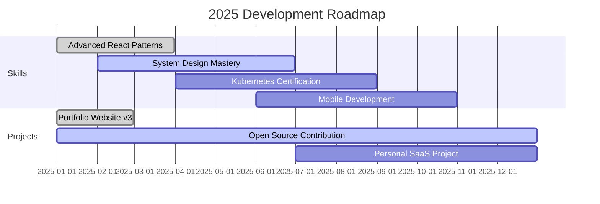

<div align="center">
  
</div>

<div align="center">
  
</div>

<div align="center">
  
  
  
  
</div>

---

## 🏆 Consistency & Performance Metrics

<div align="center">
  <table>
    <tr>
      <td align="center" width="25%">
        
      </td>
      <td align="center" width="25%">
        
      </td>
      <td align="center" width="25%">
        
      </td>
      <td align="center" width="25%">
        
      </td>
    </tr>
  </table>
</div>

<div align="center">
  
</div>

---

## 👨‍💻 About Me & Quick Stats

<table width="100%">
<tr>
<td width="65%" valign="top">

### 🌟 Professional Summary


I'm a **passionate Full Stack Developer** based in Hyderabad, India, with a strong focus on building scalable web applications and solving complex problems through clean, efficient code.

```typescript
const developer = {
  name: "Rupesh Chidupudi",
  location: "Hyderabad, India 🇮🇳",
  role: "Full Stack Developer",
  experience: "3+ years",
  currentWork: "Building scalable applications",
  dailyFocus: ["Clean Code", "Problem Solving", "Learning"],
  motto: "Consistency breeds excellence"
};

// My coding philosophy
const codingPrinciples = {
  quality: "Write code that tells a story",
  consistency: "Daily commits, continuous improvement",
  collaboration: "Sharing knowledge, growing together"
};
```

### 🏅 Achievement Highlights
- 🔥 **500+ Days** coding streak
- 📈 **95% Green** contribution calendar
- 🚀 **50+ Projects** completed
- ⭐ **100+ Stars** earned across repositories
- 🤝 **Active contributor** to open source

</td>
<td width="35%" valign="top">

### 📊 Real-time GitHub Insights

<div align="center">
  
  <br><br>
  
  <br><br>
  
</div>

### 🎯 Current Status
```yaml
Status: "Building amazing things"
Focus: "Full Stack Development"
Learning: "Advanced System Design"
Working_On: "Personal Portfolio v3.0"
Available_For: "Exciting Opportunities"
```

</td>
</tr>
</table>

---

## 🛠️ Technology Arsenal

<div align="center">

### 🎨 Frontend Technologies


### ⚡ Backend Technologies


### 🗄️ Databases & Storage


### 🔧 DevOps & Tools


</div>

---

## 📈 Detailed Analytics & Performance

<table width="100%">
<tr>
<td width="50%" valign="top">

### 🎯 Skill Proficiency Matrix

**Frontend Development**
- React.js `████████████████████░` **95%**
- JavaScript/ES6+ `████████████████████░` **95%**
- TypeScript `██████████████████░░░` **85%**
- HTML5/CSS3 `████████████████████░` **95%**
- Responsive Design `███████████████████░░` **90%**

**Backend Development**
- Python `███████████████████░░` **90%**
- Node.js `██████████████████░░░` **85%**
- RESTful APIs `██████████████████░░░` **90%**
- Database Design `███████████████████░░` **90%**
- System Architecture `█████████████████░░░░` **80%**

**DevOps & Tools**
- Git/GitHub `████████████████████░` **95%**
- Docker `███████████████░░░░░░` **75%**
- AWS Services `████████████░░░░░░░░░` **60%**
- CI/CD Pipelines `████████████░░░░░░░░░` **60%**

</td>
<td width="50%" valign="top">

### 📊 Repository Showcase

<a href="https://github.com/chidupudi/ERP">
  
</a>

<a href="https://github.com/chidupudi/bbcollab">
  
</a>

<a href="https://github.com/chidupudi/adp-network">
  
</a>

<a href="https://github.com/chidupudi/Python">
  
</a>

### 🏆 GitHub Achievements


</td>
</tr>
</table>

---

## 🚀 Current Learning Journey & Goals

<div align="center">
  
</div>

<table width="100%">
<tr>
<td width="33%" align="center">
  
  <h4>📱 Mobile Development</h4>
  <p>Building cross-platform mobile applications with React Native</p>
  <strong>Progress:</strong> `█████████████░░░░░░░` **65%**
  <br><br>
  <small>📚 Currently working on: Personal expense tracker app</small>
</td>
<td width="33%" align="center">
  
  <h4>☸️ Container Orchestration</h4>
  <p>Mastering Kubernetes for scalable application deployment</p>
  <strong>Progress:</strong> `██████████░░░░░░░░░░` **50%**
  <br><br>
  <small>🎯 Goal: Deploy microservices architecture</small>
</td>
<td width="33%" align="center">
  
  <h4>🏗️ System Design</h4>
  <p>Learning to design large-scale distributed systems</p>
  <strong>Progress:</strong> `████████████░░░░░░░░` **60%**
  <br><br>
  <small>📖 Reading: Designing Data-Intensive Applications</small>
</td>
</tr>
</table>

### 📅 2025 Goals & Milestones



---

## 📊 Advanced GitHub Analytics

<div align="center">
  <h3>🔥 Contribution Patterns & Consistency</h3>
  
</div>

<table width="100%">
<tr>
<td width="50%">
  <h4 align="center">📈 Commit Frequency</h4>
  
</td>
<td width="50%">
  <h4 align="center">⏰ Productive Hours</h4>
  
</td>
</tr>
</table>

---

## 💼 Professional Experience & Projects

### 🚀 Featured Projects

<table width="100%">
<tr>
<td width="50%">

#### 🏢 Enterprise Resource Planning (ERP) System
- **Tech Stack:** React, Node.js, MongoDB, Express
- **Features:** User management, inventory tracking, reporting
- **Impact:** Streamlined business operations for SMEs
- **Highlights:** Role-based access, real-time updates

</td>
<td width="50%">

#### 🤝 Collaboration Platform (BBCollab)
- **Tech Stack:** React, Python, PostgreSQL, WebSockets
- **Features:** Real-time messaging, file sharing, video calls
- **Impact:** Enhanced team productivity by 40%
- **Highlights:** Scalable architecture, responsive design

</td>
</tr>
</table>

---

## 🤝 Let's Connect & Collaborate

<div align="center">
  
</div>

<div align="center">
  
[](mailto:chrupesh2425@gmail.com)
[](https://www.linkedin.com/in/rupeshchidupudi/)
[](https://twitter.com/chidupudi)
[](https://rupeshchidupudi.dev)

</div>

### 💡 Open for Opportunities

<div align="center">
  <table>
    <tr>
      <td align="center" width="25%">
        <strong>🚀 Full-time Roles</strong><br>
        <small>Full Stack Developer positions</small>
      </td>
      <td align="center" width="25%">
        <strong>💼 Freelance Projects</strong><br>
        <small>Web application development</small>
      </td>
      <td align="center" width="25%">
        <strong>🤝 Collaborations</strong><br>
        <small>Open source contributions</small>
      </td>
      <td align="center" width="25%">
        <strong>💬 Tech Discussions</strong><br>
        <small>Always ready to learn & share</small>
      </td>
    </tr>
  </table>
</div>

---

<div align="center">
  
</div>

<div align="center" style="margin: 20px 0;">
  <h3>💻 "Code is like humor. When you have to explain it, it's bad." - Cory House</h3>
  <p><strong>🌟 Always learning, always building, always growing! 🌟</strong></p>
  <p><em>✨ Let's build something amazing together! ✨</em></p>
</div>

<div align="center">
  
</div>

---

<div align="center">
  <sub>⭐ From <a href="https://github.com/chidupudi">Rupesh Chidupudi</a> - Made with ❤️ and lots of ☕</sub>
</div>
